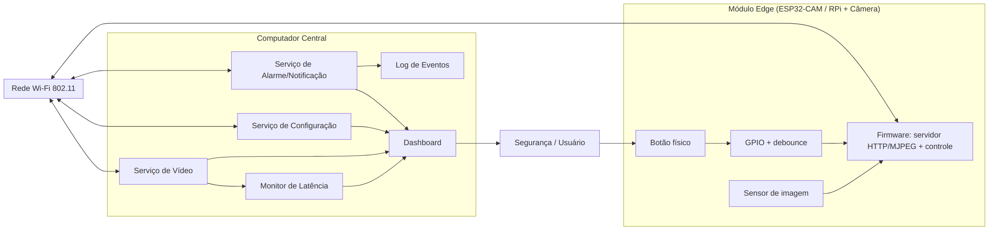
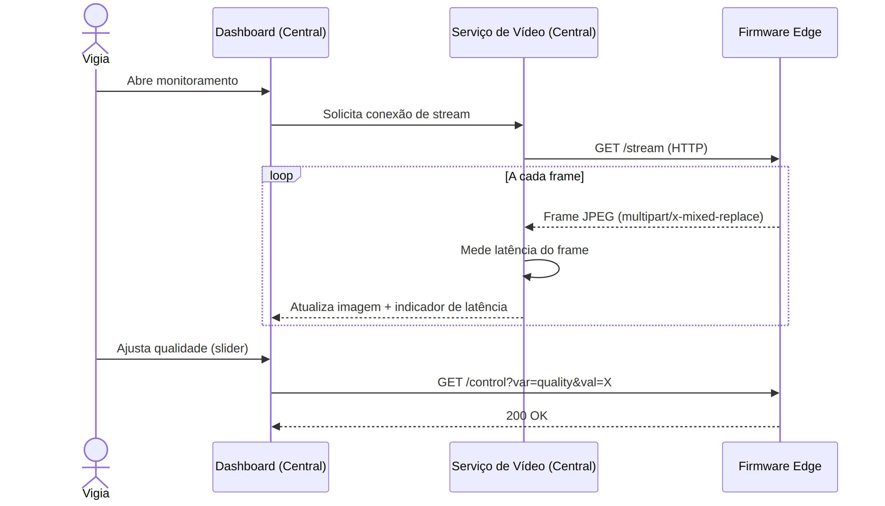
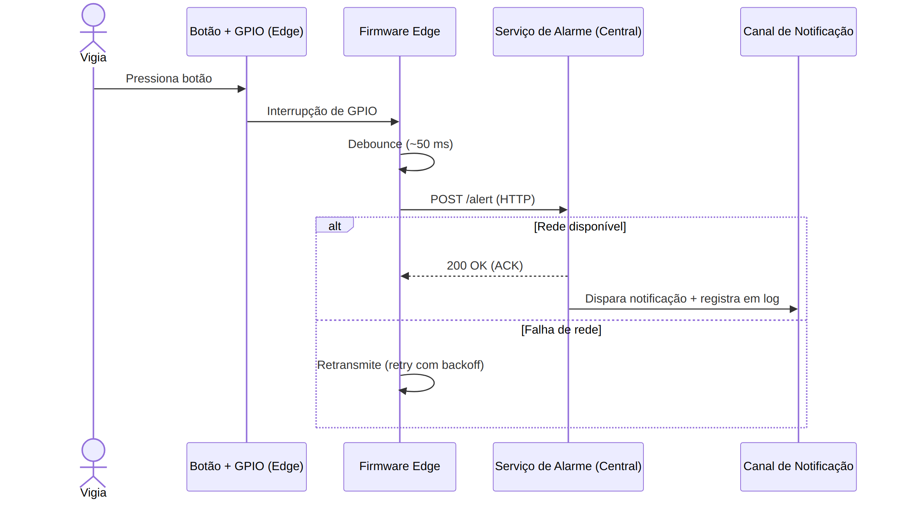

# Porteiro Eletrônico Inteligente — Sistema de Segurança com Vídeo e Alerta

**Disciplina:** PCS3732 — Laboratório de Processadores
**Entrega:** Semana 2 — Servidor de vídeo / Streaming da câmera (RF1)

> **Integrantes:**
> - Douglas Monteiro Almeida Souza — NUSP 10748048
> - Guilherme Junji Tutiya — NUSP 14576065
> - Henrique Maruiti — NUSP 12610243

---

## 1. Motivação / Justificativa

Sistemas de portaria e monitoramento por vídeo são cada vez mais comuns em
condomínios, comércios e instituições, mas soluções comerciais completas
costumam ter custo elevado e serem fechadas (difíceis de adaptar). O objetivo
deste projeto é demonstrar, com hardware de baixo custo (Raspberry Pi + câmera),
que é possível montar um **porteiro eletrônico** que transmite vídeo em tempo
real para um posto de monitoramento e permite ao vigia acionar um **alerta de
emergência** por um botão físico.

A ideia central é a de um sistema de vigilância simples: uma câmera controlada
por um Raspberry Pi, um computador central que exibe o vídeo em *streaming* e um
botão que dispara uma notificação (por exemplo, acionar a polícia) ao identificar
algo suspeito.

Projetos e referências similares:

- Streaming de vídeo com ESP32-CAM via Wi-Fi (tutorial de referência):
  <https://www.youtube.com/watch?v=YG08Sl1JbQw>
- Transmissão MJPEG (`multipart/x-mixed-replace`) como técnica de baixo custo de
  latência para vídeo em rede local.

## 2. Objetivos

**Objetivo geral:** desenvolver um sistema de segurança que simula um porteiro
eletrônico, com transmissão de vídeo em tempo real para um computador central e
acionamento de alerta de emergência por botão físico.

**Objetivos específicos:**

- Transmitir vídeo da câmera da borda para o central em tempo real (MJPEG).
- Permitir ajuste da qualidade da câmera via software, remotamente.
- Detectar o acionamento de um botão físico e disparar uma notificação de emergência.
- Monitorar e controlar a latência da transmissão.
- Garantir disponibilidade do sistema durante a operação (reconexão automática).
- Estruturar o código em camadas de baixo acoplamento, facilitando manutenção e
  troca de hardware.

## 3. Requisitos Funcionais

| ID | Requisito |
|----|-----------|
| RF1 | Câmera que transmite vídeo em tempo real. |
| RF2 | Botão físico que aciona um alarme/notificação de emergência. |
| RF3 | Ajuste da qualidade da câmera via software. |

## 4. Requisitos Não Funcionais

| ID | Requisito |
|----|-----------|
| RNF1 | Controle de latência da câmera. |
| RNF2 | Disponibilidade de pelo menos 95% do tempo de operação. |
| RNF3 | Código com padrões que facilitam alterações futuras (baixo acoplamento). |

## 5. Diagramas da Arquitetura

As fontes editáveis dos diagramas estão em [`diagramas/`](diagramas/) (formato
D2); as figuras renderizadas, em [`figuras/`](figuras/).

## 6. Arquitetura Física

A solução usa uma arquitetura cliente-servidor em três camadas, com baixo
acoplamento entre elas:

1. **Borda (Edge)** — Raspberry Pi 3B+ com a câmera e o botão de alarme. Roda o
   firmware que captura imagem e serve o vídeo, além de ler o botão via GPIO.
2. **Rede Wi-Fi 802.11** — canal de comunicação entre borda e central. Na
   Semana 2 adotou-se o Raspberry Pi em **modo Access Point** (hotspot próprio,
   via `nmcli`): o central conecta-se diretamente ao Wi-Fi do Pi (IP ~`10.42.0.1`),
   sem roteador nem internet. Isso adequa-se a um porteiro local e contorna o
   *isolamento de clientes* comum em redes compartilhadas (ex.: Wi-Fi
   institucional), que impede um dispositivo de alcançar o outro.
3. **Computador Central** — recebe o vídeo, exibe a interface de monitoramento
   (Dashboard), mede a latência, permite configurar a câmera e trata o alarme.

**Pendência de hardware (câmera):** a captura de vídeo é parte essencial do
projeto. Ainda é necessário **confirmar o acesso ao módulo de câmera CSI** para o
Raspberry Pi; caso não esteja disponível, a alternativa é usar uma **câmera USB**.
Essa decisão altera apenas o backend de captura (ver Seção 7), não a arquitetura.

## 7. Arquitetura de Software

**Modelagem estática.** O código é dividido por camada (ver [`src/`](../src/)):

- `src/rpi/camera_stream.py` — servidor de vídeo da borda (**implementado na
  Semana 2**: `GET /` e `GET /stream` MJPEG). A captura fica isolada atrás de uma
  interface (`FrameSource`), com o backend escolhido automaticamente por
  `make_source()` na ordem `picamera2` (módulo CSI, primário) → OpenCV/V4L2
  (câmera USB, *fallback*) → fonte sintética (frames gerados por software, para
  desenvolvimento e teste sem hardware). Assim, a pendência da câmera não afeta o
  restante do sistema (RNF3).
- `src/rpi/alarme.py` — leitura do botão com `gpiozero.Button` e debounce por
  `bounce_time`.
- `src/central/monitor.py` — Dashboard/Serviço de Vídeo, Monitor de Latência e
  Serviço de Alarme.

**Modelagem comportamental.** Dois fluxos principais:

- *Streaming:* o central abre `GET /stream` no firmware; a cada frame, um JPEG
  independente é enviado no formato `multipart/x-mixed-replace`, a latência é
  medida e a imagem é atualizada. A qualidade é ajustada por
  `GET /control?var=quality&val=X`.

  

- *Alarme:* ao pressionar o botão, a interrupção de GPIO passa por debounce
  (~50 ms) e o firmware envia `POST /alert` ao central. Havendo rede, o central
  responde `200 OK` (ACK), dispara a notificação e registra em log; em falha de
  rede, o firmware retransmite com *retry* e *backoff*.

  

### 7.1 Rastreabilidade Requisito → Componente

| Requisito | Tipo | Componente(s) | Como é atendido / Justificativa |
|-----------|------|---------------|---------------------------------|
| Câmera transmite em tempo real | Funcional | Sensor de imagem + firmware Edge (MJPEG) + Serviço de Vídeo | Streaming `multipart/x-mixed-replace`: cada frame é independente (sem codec complexo), latência próxima a um período de frame (ZBOTIC, 2026). |
| Botão aciona alarme | Funcional | GPIO + debounce (Edge), Serviço de Alarme, notificação | Debounce por software evita leituras falsas do contato mecânico (MAKERHERO, 2024); envio HTTP com ACK e retry garante entrega do evento. |
| Ajuste de qualidade via software | Funcional | Serviço de Configuração + endpoint de controle no Edge | Parâmetro de compressão/resolução alterado remotamente, sem novo firmware — atende ao requisito e reforça manutenibilidade. |
| Controle de latência | Não funcional | Monitor de Latência + fallback adaptativo no Edge | Mede o tempo de chegada de cada frame; acima do limiar, reduz resolução/qualidade automaticamente. |
| Disponibilidade ≥ 95% | Não funcional | Reconexão automática de Wi-Fi + retry/backoff + log | Reduz perda de eventos em instabilidades momentâneas de rede; alinhado ao atributo de confiabilidade/disponibilidade da ISO/IEC 25010 (2011). |
| Código manutenível | Não funcional | Separação em camadas (firmware Edge / serviços Central / interface) | Baixo acoplamento permite trocar hardware (CSI ↔ USB) ou canal de notificação sem redesenho — princípio de modularidade da ISO/IEC 25010 (2011). |

## 8. Ferramentas Utilizadas

**Linguagens:** Python.

**Bibliotecas/Frameworks:** `picamera2` ou OpenCV (captura de imagem), Flask
(servidor HTTP/MJPEG), `gpiozero` (leitura do botão / GPIO), `requests` (envio do
alerta). D2 para os diagramas.

**Hardware:** Raspberry Pi 3B+, câmera (módulo CSI a confirmar, ou câmera USB),
botão físico do kit.

## 9. Metodologia de Desenvolvimento

- Desenvolvimento incremental ao longo de quatro semanas, com uma *Release* por
  semana no GitHub e o PDF correspondente no Moodle.
- Repositório público, com histórico de commits incrementais, uso de *branches* e
  *Pull Requests* (com **branch única `main`** na entrega final).
- Documentação em Markdown, podendo ser convertida para LaTeX na versão final.
- Documentação do código com **docstrings no padrão Google**.
- Revisão por pares na Semana 2, via GitHub Issues.

## 10. Testes Planejados

A estratégia de validação e a rastreabilidade entre requisitos e casos de teste
estão em [`tests/rastreabilidade.md`](../tests/rastreabilidade.md). Na Semana 2 o
**RF1 passou a resultado obtido**: o stream MJPEG rodou no Raspberry Pi e foi
assistido de outro computador pelo navegador (vídeo contínuo), com o Pi provendo
a rede em modo Access Point. Os demais casos seguem planejados. Os casos de RF2
(evento único por clique) e RNF3 (backend plugável) são candidatos a **testes
automatizados** (ponto extra); há uma primeira checagem executável do pipe de
vídeo em `tests/test_camera_stream.py`.

## 11. Conclusões (Preliminares)

Nesta primeira semana o projeto foi estruturado: repositório organizado,
documentação inicial, diagramas de arquitetura e esqueleto do código em camadas.
A arquitetura em três camadas de baixo acoplamento tende a atender aos requisitos
funcionais (streaming, alarme, ajuste de qualidade) e não funcionais (latência,
disponibilidade, manutenibilidade). Na Semana 2, o servidor de vídeo foi
implementado e o **RF1 validado em hardware** — a câmera do Pi foi assistida de
outro computador (Pi em modo Access Point) —, confirmando na prática a
viabilidade da captura plugável e do streaming MJPEG.

**Riscos e dificuldades previstas:** confirmação do módulo de câmera CSI (com
*fallback* para câmera USB) e a latência do MJPEG sob a capacidade do Raspberry
Pi 3B+. **Próximos passos:** o ajuste de qualidade (`GET /control`, RF3) e o
fluxo do botão de emergência (RF2), seguindo com os testes da Seção 10.

## Referências

ESPRESSIF SYSTEMS. **ESP32 Series Datasheet**. Version 4.3. Shanghai: Espressif
Systems, 2023. Disponível em:
<https://www.espressif.com/sites/default/files/documentation/esp32_datasheet_en.pdf>.
Acesso em: 18 jun. 2026.

INTERNATIONAL ORGANIZATION FOR STANDARDIZATION. **ISO/IEC 25010:2011** — Systems
and software engineering — Systems and software Quality Requirements and
Evaluation (SQuaRE) — System and software quality models. Geneva: ISO, 2011.

MAKERHERO. **Debounce: tratando o efeito bounce de botões e chaves**. 2024.
Disponível em: <https://www.makerhero.com/>. Acesso em: 18 jun. 2026.

ZBOTIC. **Streaming de vídeo MJPEG em sistemas embarcados**. 2026.
